##### UET Lahore Department Of Computer Science Operating System Lab

##### Abdullah Azher Chaudhary 2022-CS-204

### Manual Of Installing Ubuntu In VMWare

### Step 1 => Downloading VMWare

Click on this [VMWare](https://www.vmware.com/products/workstation-player/workstation-player-evaluation.html "VMWare Download Link") link to download VMWare if you haven't downloaded VMWare on your device.
Scroll down and click on the "Try Workstation 17 Player for Windows":

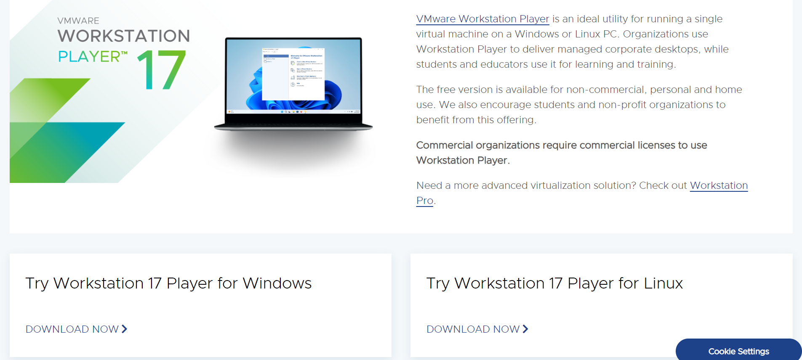

### Step 2 => Download Ubuntu Image

Download Ubuntu from this link ["Ubuntu"](https://ubuntu.com/download/desktop "Ubuntu download Link"). Click on the following link to download latest version if you haven't downloaded Ubuntu image on you device. Click on the Green Button in the image to download Ubuntu Iso file.

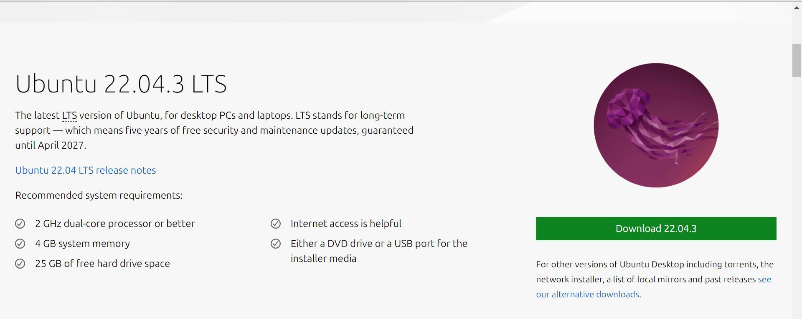

### Step 3 => Installing VMWare

- Open the VMWare iso image on your device.
  

- Click On Next
  

- Accept the Terms & Conditions and click on next.
  

- Confirm the path, Where you want to store and click on next.
  

- Setup whether you want to create VMWare Desktop Icon and Taskbar Icon.
  

- Wait till VMWare is installing.
  
- Click on 'Finish' after VMWare is installed.
  

### Step 4 => Installing Ubuntu

- Open VMWare by searching "VMware Workstation 17 Player" on search bar.
  

- ###### After Opening Click on "**Create a New Virtual Machine**" option.

  

- Click on "**Browse..**" and select your downloaded Ubuntu Iso file.
  

- Create your Virtual Machine Credentials.
  

- Create a name and set location for your virtual machine and click next.
  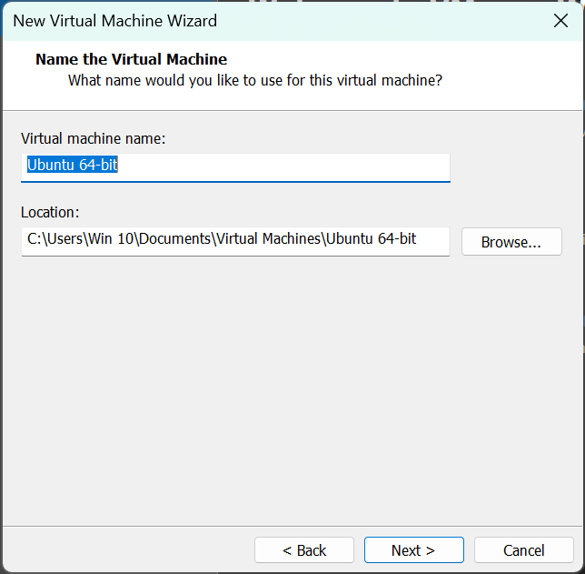

- Set storage size of your Ubuntu machine and click next.
  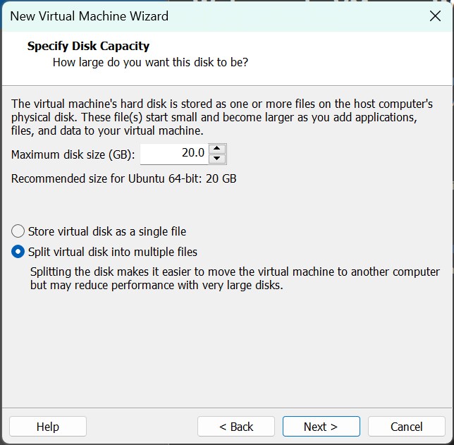

- Click on Customize Hardware
  

- Setup "**Ram**" and make sure in "**New CD\DVD(SATA)**" Ubuntu iso is selected in "Use ISO image file", then click on "**Close**".
  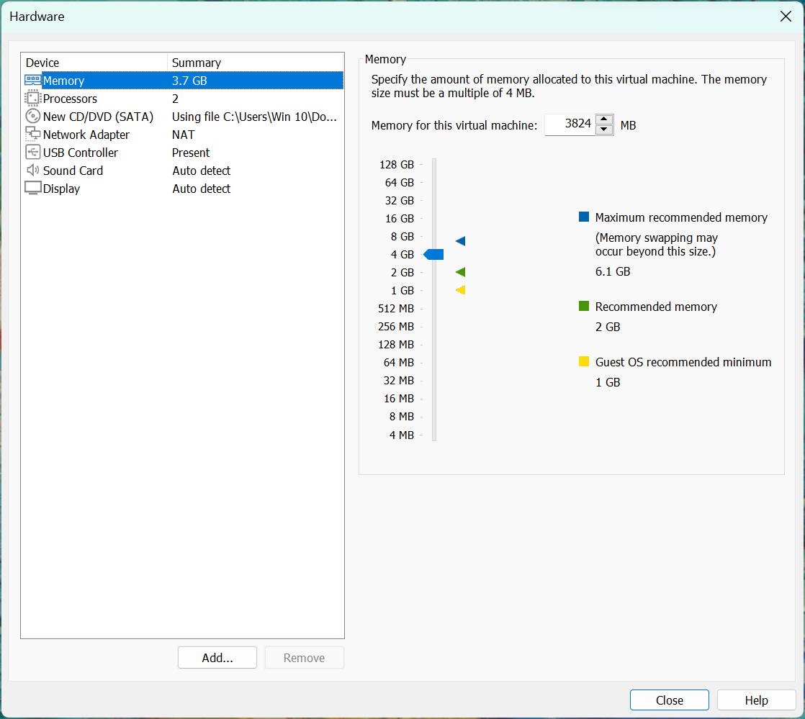
- Click on "Finish" to start Ubuntu.
  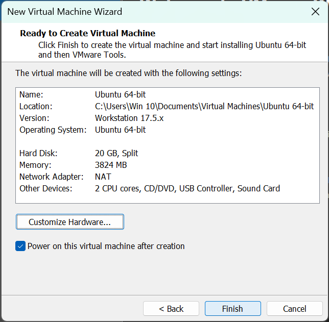

- Ubuntu will start. It'll take some time to boot the device.
  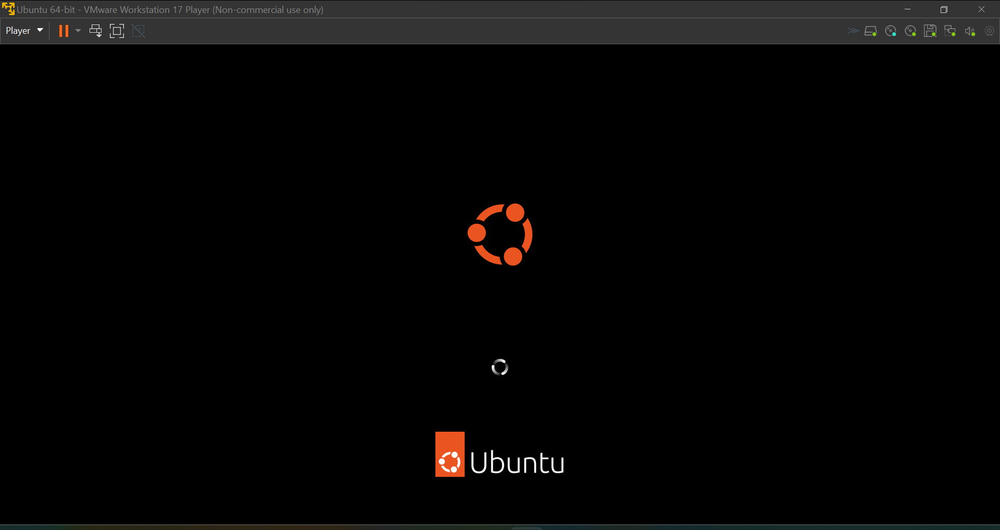
- Select Your Ubuntu "**_Language_**" and click on "**Next**",
  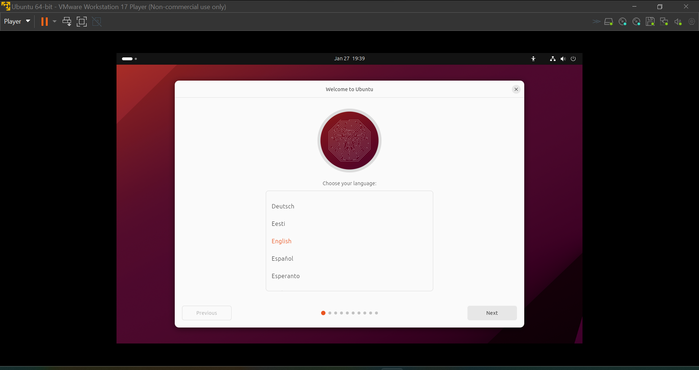

- Select "**Install Ubuntu**" and click on "**Next**".
  

- Setup keyboard Layout and click on next.
  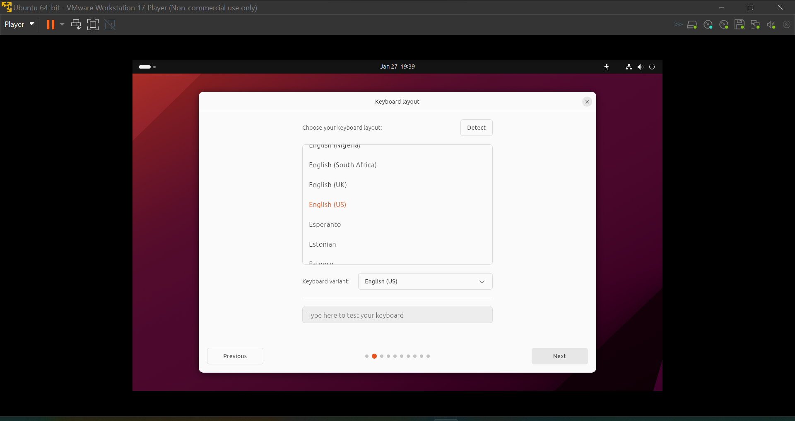

- Select "Full installation" to install Utilities else Select "Default installation", select the remaining options. 

- Select "**Erase disk and install Ubuntu**" and click next.
  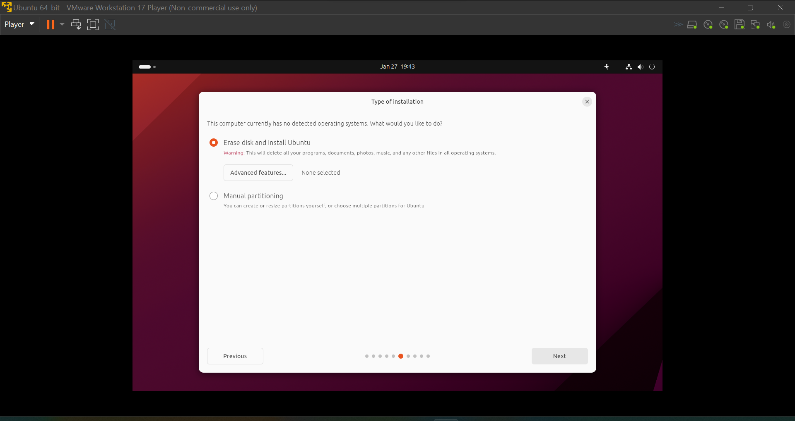

- Setup your account and click next.
  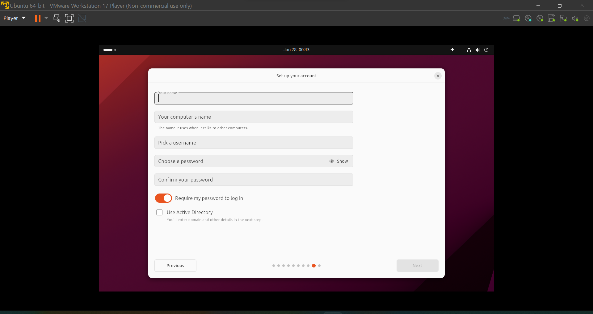

- Wait for installation to complete, This step will take sometime depending on the hardware configurations that you have provided.
  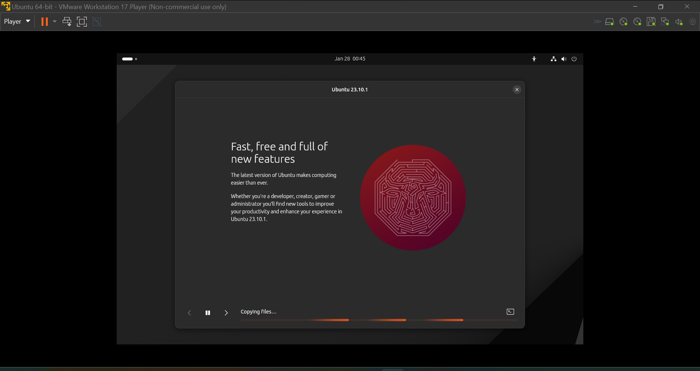

- Restart after Ubuntu is installed.
  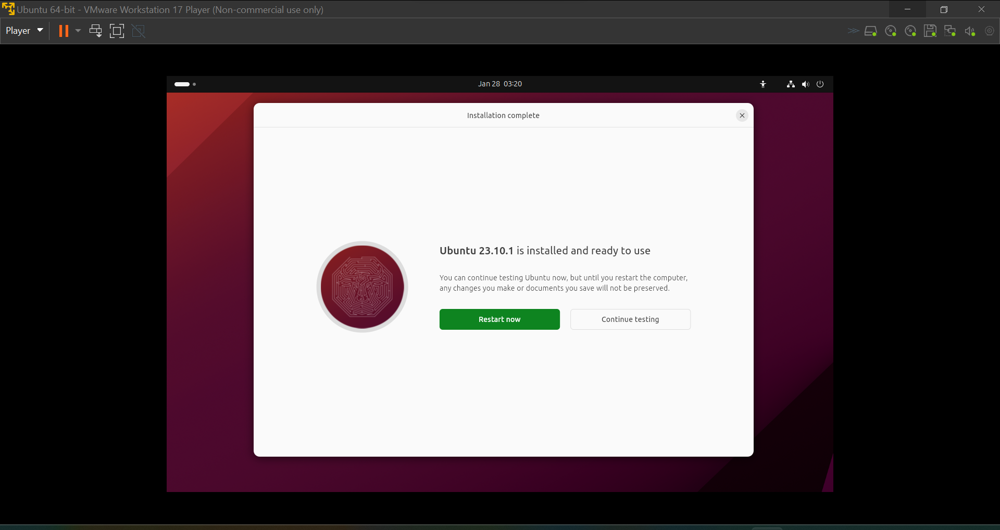

- After restart your Ubuntu will be installed, You can setup your account and change display settings in the settings app by click on the bar on the top left. 

### All done you have successfully installed Ubuntu on a virtual machine.
