#### Department Of Computer Science UET Lahore

#### Operating System Lab

#### Abdullah Azher Chaudhary 2022-CS-204

### Task 1

##### Create 2 files which contain 10 lines each:

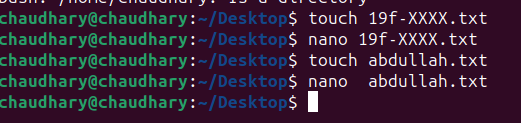

##### Merge data of both files

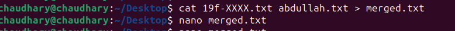

##### Display the first two lines of first file

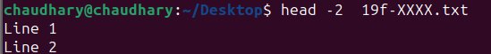

##### Display the last two lines of second file

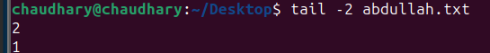

##### Find string of your roll number from file

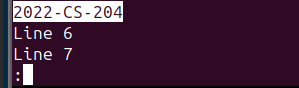

##### Grant the execute permission of the second file to the group.

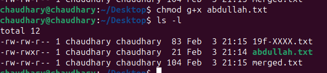

##### Remove the write permission for the owner

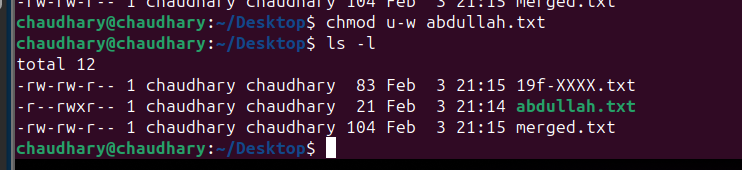

##### Display current location

##### List files in Desktop Directory

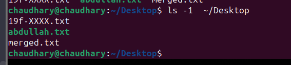

##### Display Time

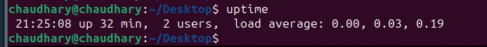

##### Display a Thank You Message

### Task 2

##### Create a file named “19f-XXXX_OS-lab_rules.txt” using linux commands.

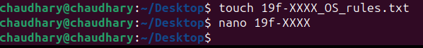

##### The file must contain all lab rules covered in first lab

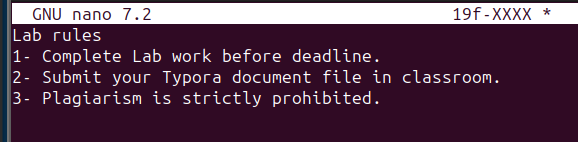

##### Set the rights of created file to this (- rwx r-x r--)

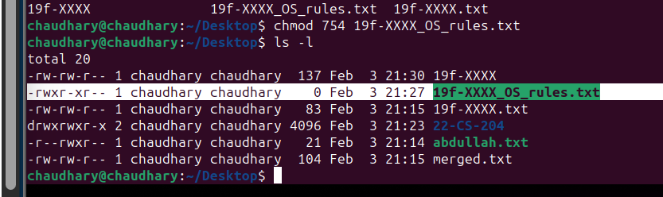

##### Append the output of ls command to created file

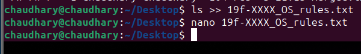

### END OF FILE
