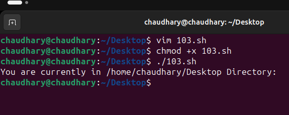

#### Department Of Computer Science UET Lahore

#### Operating System Lab

#### Abdullah Azher Chaudhary 2022-CS-204

### Task 1

#### Mr. Tom Guide to Shell Scripting

#### 1-> Create a simple script which will take two command line arguments and then multiply them together

#### 2-> Create a simple script, which will ask the user for a few pieces of information then combine this into a message which is echo'd to the screen

#### 3-> Now Mr. Tom suddenly lost the track of his current location. Help him find his location.

#### 4-> List of all files present on home directory

#### 5-> Display the current time

#### 6-> Display a Thank You Message

### Task 2

#### 1-> Write a simple shell script that uses arithmetic operators (+, -,\*) using double parenthesis with printing your own roll # with the results of operations

#### 2-> Write a simple shell script that uses all relational operators with printing your own roll # with the results of operations.

