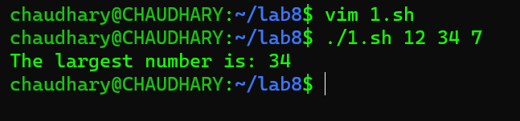
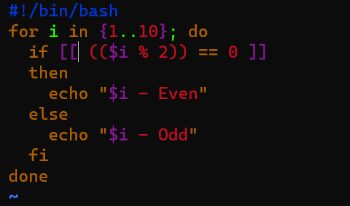
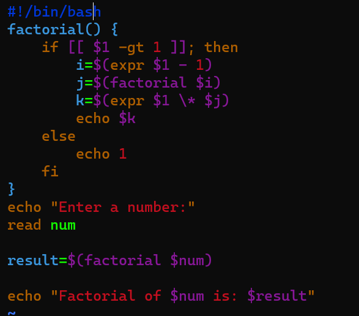

#### Department Of Computer Science UET Lahore

#### Operating System Lab

#### Abdullah Azher Chaudhary 2022-CS-204

### Task 1

#### 1-> Create a Bash script which will take 3 numbers as command line arguments. It will print to the screen the larger of the three numbers.

#### 2-> Create a Bash script which will print a message based upon which day of the week it is using switch statement.

### Task 2

#### 1-> Create a simple script which will print the numbers 1 - 10 (each on a separate line) and whether they are even or odd.

#### 2-> Write a program that read number as input, calculate, and return the summation of the all digits of the number.

### Task 3

#### 1-> Write a shell script which takes a positive integer as an argument on the terminal and then checks if it is a palindrome or not. In order to find the reverse of this number it must be passed to function named reverse(), which computes the reverse and passes both, the number and its reverse to another function called palindromeCheck(). palindromeCheck() then compares the numbers and echoes if the number is a palindrome or not.

#### 2-> Write a shell script which reads a number from the user and passes it to function named factorial(). This function finds the factorial of the number and prints it on the terminal. This task must be done using recursion.

